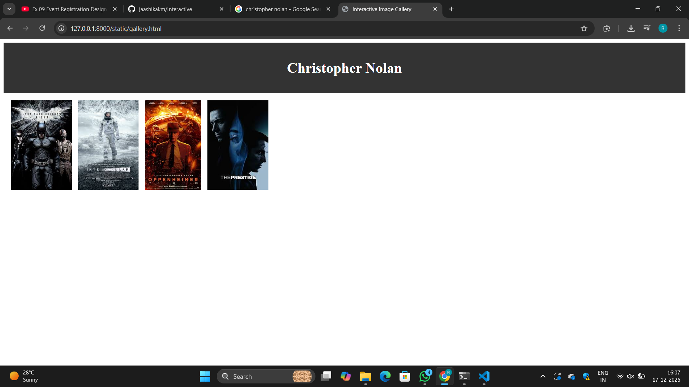
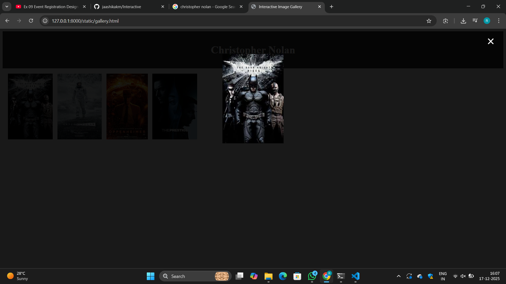
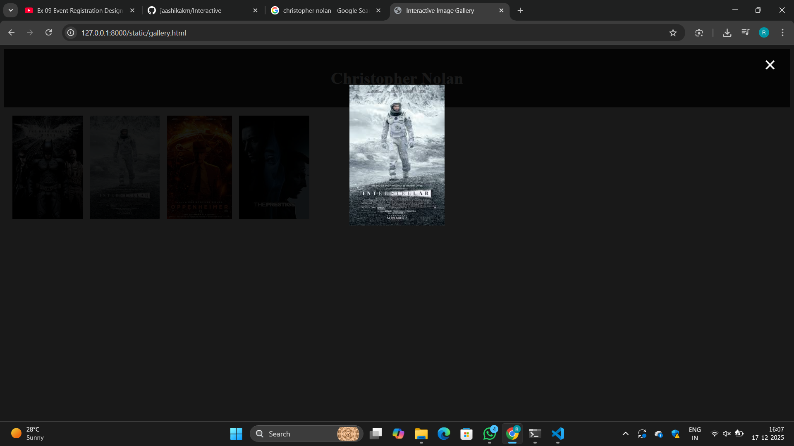
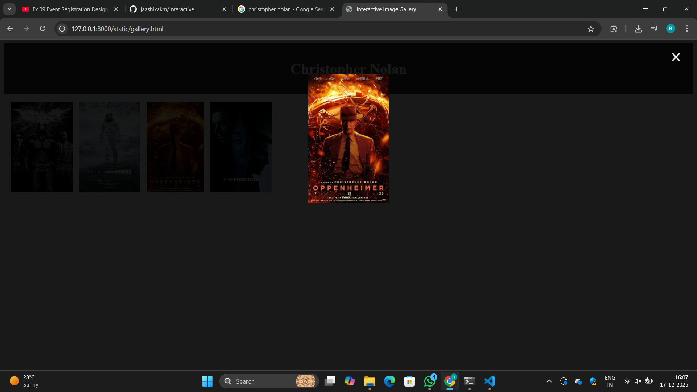
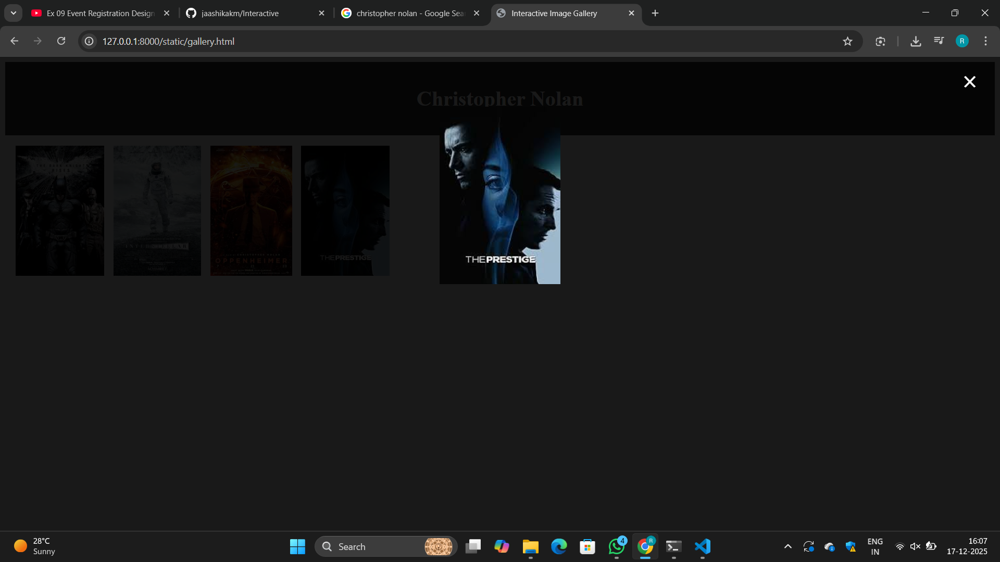

# Ex.08 Design of Interactive Image Gallery
## Date: 17/12/2025

## AIM:
To design a web application for an inteactive image gallery with minimum five images.

## DESIGN STEPS:

### Step 1:
Clone the github repository and create Django admin interface.

### Step 2:
Change settings.py file to allow request from all hosts.

### Step 3:
Use CSS for positioning and styling.

### Step 4:
Write JavaScript program for implementing interactivity.

### Step 5:
Validate the HTML and CSS code.

### Step 6:
Publish the website in the given URL.

## PROGRAM :
```
c:\Users\acer\OneDrive\Pictures\Screenshots\Screenshot (128).png c:\Users\acer\OneDrive\Pictures\Screenshots\Screenshot (132).png c:\Users\acer\OneDrive\Pictures\Screenshots\Screenshot (131).png c:\Users\acer\OneDrive\Pictures\Screenshots\Screenshot (130).png c:\Users\acer\OneDrive\Pictures\Screenshots\Screenshot (129).png
```
## OUTPUT:





## RESULT:
The program for designing an interactive image gallery using HTML, CSS and JavaScript is executed successfully.
